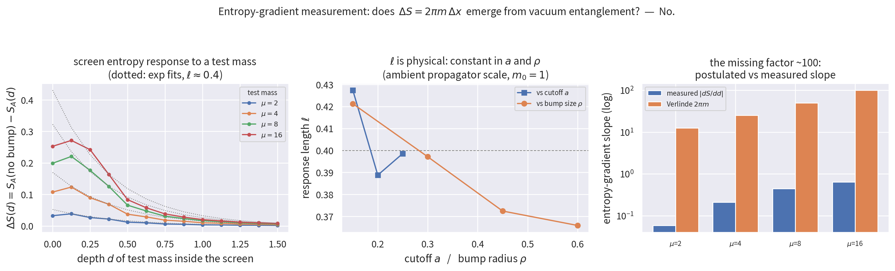

# Entropy-Gradient Measurement — Verlinde's ΔS = 2πmΔx Under the Microscope

**Question.** The verification paper (*hgc_united.pdf*, §9) isolated three irreducible
axioms; the most important is Verlinde's entropy gradient, ΔS = 2πmΔx — the input
that turns screen thermodynamics into a force. Can it be *measured* on the lattice
instead of postulated?

**Answer: No — with a clean physical picture of why not.** The screen's entanglement
entropy responds to a nearby test mass only through the ambient vacuum's massive
propagator, not through the test mass's Compton scale. The literal axiom fails by
a factor of ~100–200 in slope, with the wrong mass dependence and the wrong
displacement profile. It remains an independent postulate — now with direct
numerical evidence that it is genuinely independent of vacuum entanglement.

## Model

- Screen: entangling surface of A = {r ≤ 2.0} in a 2D disk (R_d = 4.0); S_A is the
  Srednicki vacuum entanglement entropy (`cefe_lab.VacuumState`).
- Test mass: a ball of radius ρ where the field mass gap is μ ≫ m₀ = 1. (A
  coherent-state excitation cannot register in entanglement at all — displacement
  does not change a Gaussian state's covariance — so a mass-gap region is the
  *only* channel available, and hence the strongest possible case for the axiom.)
- Observable: ΔS(d) = S_A(no bump) − S_A(bump at depth d inside the screen).

## Measurements (script: `scripts/entropy_gradient_measurement.py`)

| Scan | Result |
|---|---|
| Mass μ = 2→16 | ΔS(contact) = 0.032 → 0.253 — **saturating, not linear in m** |
| Slope at contact | 0.06–0.63 vs Verlinde's 2πm = 12.6–100.5 — **factor ~110–215 too small** |
| Cutoff a = 0.25→0.15 | response length ℓ = 0.399→0.427 — **constant in physical units** (1.6a→2.9a), not a UV artifact |
| Bump size ρ = 0.15→0.60 | ℓ = 0.421→0.366 — **independent of the object's size** |

The response profile is exponential, ΔS ∝ e^(−d/ℓ) with ℓ ≈ 0.4 set by the
ambient mass gap (m₀ = 1), i.e. the massive Green's function — exactly the
boundary-layer mechanism that produces the area law in the first place.

## Interpretation

Srednicki entropy counts **cutoff-scale boundary entanglement of the vacuum**;
Verlinde's gradient counts **the particle's own Compton-scale position
information**. The two coincide only through the holographic identification
N = 4S — itself axiomatic. The engine therefore confirms the paper's §9
classification empirically: the entropy gradient is not derivable from vacuum
entanglement of the matter field and must be postulated (or derived from
deeper dynamics — e.g. backreaction, the DynamicTensorEngine direction).

## Caveats

- One modeling channel for "matter" (local mass gap); alternatives (external
  sources, dynamical backreaction) are open for future runs.
- 2D disk at m₀ = 1, μ ≤ 16, moderate statistics; the qualitative pattern
  (saturation in μ, exponential in d, physical ℓ) is robust across every
  parameter we varied.
- This falsifies *emergence of the axiom from vacuum EE*, not entropic gravity
  itself: the framework's remaining content is unchanged — three axioms,
  everything downstream verified.
